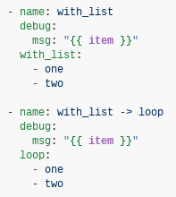

:doctype: article
:reproducible:
:icons: font
:iconsdir: /etc/asciidoc/images/icons
:numbered:
:sectlinks:
:sectnums:
:toc: left
:toclevels: 3
:tabsize: 8
:numbered:
:source-highlighter: rouge
:experimental:

== Working with Playbooks

=== Intro to Playbooks

==== About Playbooks

==== Playbooks Language Example

==== Basics

==== Action Shorthand

==== Handlers: Running Operations On Change

==== Executing A Playbook

==== Ansible-Pull

==== Linting playbooks

==== Other playbook verification options

=== Creating Reusable Playbooks

==== Including and Importing

==== Roles

==== Dynamic vs. Static

==== Differences Between Dynamic and Static

==== Tradeoffs and Pitfalls Between Includes and Imports

=== Using Variables

==== Creating valid variable names

==== Defining variables in inventory

==== Defining variables in a playbook

==== Defining variables in included files and roles

==== Using variables with Jinja2

==== Transforming variables with Jinja2 filters

==== Hey wait, a YAML gotcha

==== Variables discovered from systems: Facts

==== Registering variables

==== Accessing complex variable data

==== Accessing information about other hosts with magic variables

==== Defining variables in files

==== Passing variables on the command line

==== Variable precedence: Where should I put a variable?

==== Using advanced variable syntax

=== Tamplating (Jinja2)

==== Filters

==== Tests

==== Lookups

==== Python Version and Templating

==== Get the current time

=== Conditionals

==== The When Statement

==== Loops and Conditionals

==== Loading in Custom Facts

==== Applying 'when' to roles, imports, and includes

==== Conditional Imports

==== Selecting Files And Templates Based On Variables

==== Register Variables

==== Commonly Used Facts

=== Loops

==== Comparing loop and with_*

==== Standard loops

==== Registering variables with a loop

==== Complex loops

==== Ensuring list input for loop: query vs. lookup

==== Adding controls to loops

==== Migrating from with_X to Loop

With the release of Ansible 2.5 and later, the recommended way to perform loops is the use the new `loop` keyword instead of `with_X` style loops.

Here, I am going to show how to convert `with_` style loops to `loop`.

*with_list*

`with_list` is directly replaced by `loop`

REAL WORLD EXAMPLE:

The problem is: We have a openshift cluster environment running on vlan 10, we need to add more app-nodes to the cluster, but the networking team said that there is no more available IPs on vlan 10, so the networking team had created a vlan 20. There is a Firewall between the vlans, before we start adding new app-nodes we are going to create an Ansible playbook to check the connectivity between the vlans.  

In this example we are going to have a bastion(ansible machine),two sources machines(masters) and one target machine(new_nodes).

. Create the hosts iventory file 
+
[source,yaml]
.[root@bastion v3]# cat hosts.yml 
----
[masters]
host1.ansible-training.lab
host2.ansible-training.lab

[infras]

[new_nodes]
host3.ansible-training.lab

[ocs]

[all:children]
masters
infras
new_nodes
ocs

[source:children]
masters
infras
new_nodes
----

. Create the playbook file called `checkports_send.yaml`.
+
[source,yaml]
.[root@bastion v3]# cat checkports_send.yaml
----
---                                                                                                                                                                                             
- name: Required Tools installation                                                                                                                                                             
  hosts: all                                                                                                                                                                                    
  become: yes                                                                                                                                                                                   
  become_user: root                                                                                                                                                                             
  tasks:                                                                                                                                                                                        
    - name: Install tools                                                                                                                                                                       
      yum:                                                                                                                                                                                      
        name: "{{ packages }}"
      vars:                                                                                                                                                                                     
        packages:                                                                                                                                                                               
          - qperf                                                                                                                                                                               
          - nc                                                                                                                                                                                  
        state: latest                                                                                                                                                                           
    - name: Open firewall ports for required tools                                                                                                                                              
      firewalld:                                                                                                                                                                                
        port: 19765/tcp                                                                                                                                                                         
        permanent: no                                                                                                                                                                           
        immediate: yes                                                                                                                                                                          
        state: enabled                                                                                                                                                                          

- name: Allow network ports 
  hosts: new_nodes
  become: yes
  become_user: root
  vars:
    ports:
      - 53/tcp
      - 8053/tcp
      - 9200/tcp
      - 9300/tcp
      - 2049/tcp
      - 24007-24008/tcp
      - 24010/tcp
      - 3260/tcp
      - 111/tcp
      - 49152-49664/tcp
      - 10250/tcp
      - 4789/udp
      - 8053/udp
      - 53/udp
  tasks:
    - name: Open required TCP port {{ ports }}
      firewalld:
        permanent: no
        immediate: yes
        state: enabled
        port: "{{ item }}"
      with_items: "{{ ports }}"

- name: create a fake network TCP ports 
  hosts: new_nodes
  vars:
    ports:
      - 53
      - 8053
      - 9200
      - 9300
      - 2049
      - 24007
      - 24008
      - 24010
      - 3260
      - 111
      - 10250
      - 49152
      - 49664
  become: yes
  become_user: root
  tasks:
    - name: Perform NC command to open a fake port
      shell: nohup nc -4lk "{{ item  }}" &
      with_items: "{{ ports }}"

- name: Open network UDP ports 
  hosts: new_nodes
  vars:
    ports:
      - 4789
      - 8053
      - 53
  become: yes
  become_user: root
  tasks:
    - name: Perform NC command to open a fake port
      shell: nohup nc -u -4l "{{ item  }}" &
      with_items: "{{ ports }}"

- name: Check all tcp ports
  hosts: masters
  become: yes
  become_user: root
  vars:
    ports:
      - 53
      - 8053
      - 9200
      - 9300
      - 2049
      - 24007
      - 24008
      - 24010
      - 3260
      - 10250
      - 22
      - 49152
      - 49664
  tasks:
    - name: Open required TCP port {{ ports }}
      command: /usr/bin/nc -vz host3.ansible-training.lab "{{ item  }}"
      register: result
      with_items: "{{ ports }}"
    - debug:
        var: result 

- name: Check all udp ports
  hosts: masters
  become: yes
  become_user: root
  vars:
    ports:
      - 4789
      - 8053
      - 53
  tasks:
    - name: Open required UDP port {{ ports }}
      command: /usr/bin/nc -uvz host3.ansible-training.lab "{{ item  }}"
      register: result
      with_items: "{{ ports }}"
    - debug:
        var: result 
----

 

=== Blocks

==== Blocks error handling

=== Advanced Playbooks Features

==== Understanding privilege escalation: become

==== Asynchronous Actions and Polling

==== Check Mode ('Dry Run')

==== Playbook Debugger

==== Delegation, Rolling Updates, and Local Actions

==== Setting the Environment (and Working With Proxies)

==== Working With Language-Specific Version Managers

==== Error Handling In Playbooks

==== Advanced Syntax

==== Working With Plugins

==== Prompts

==== Tags

==== Using Vault in playbooks

==== Start and Step

==== Playbook keywords

==== Lookups

==== Module defaults

=== Controlling playbook execution: strategies and more

==== Selecting a strategy

==== Setting the number of forks

==== Using keywords to control execution

=== Best Practices

==== Content Organization

==== Staging vs Production

==== Rolling Updates

==== Always Mention The State

==== Group By Roles 

==== Operating System and Distribution Variance

==== Bundling Ansible Modules With Playbooks

==== Whitespace and Comments

==== Always Names Tasks

==== Keep It Simple

==== Version Control

==== Variable and Vaults

=== Playbook Example: Continuous Delivery and Rolling Upgrades

==== What is continuous Delivery?

==== Site deployment

==== Reusable content: roles

==== Configuration: group variables

==== The rolling upgrade

==== Managing other load balancers

==== Continuous delivery end-to-end
